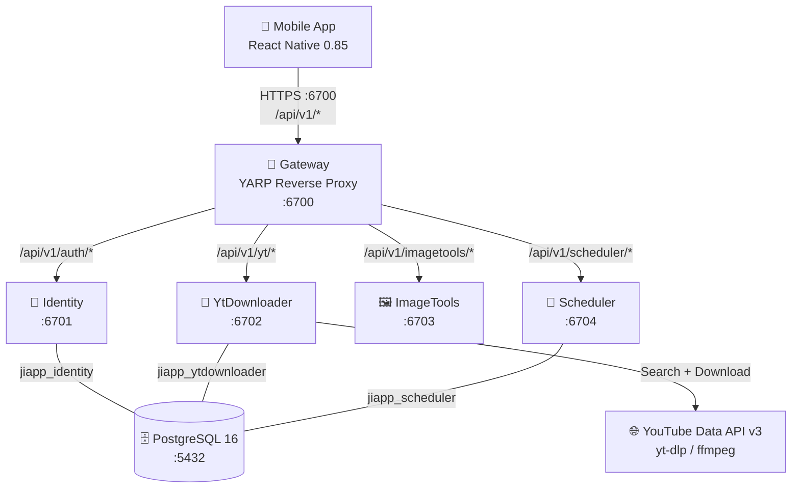

# JiApp — Salon Management Platform

A mobile-first salon management platform with a .NET 10 microservices backend and React Native Android app. Handles YouTube-powered background music, client and appointment scheduling, expense tracking, and revenue reporting.

## Architecture



## Tech Stack

### Backend

| Layer | Technology | Version |
|-------|-----------|---------|
| Runtime | .NET, ASP.NET Core Minimal APIs | 10.0 |
| API Gateway | YARP Reverse Proxy | 2.3 |
| Auth | ASP.NET Core Identity + JWT Bearer | 10.0 |
| Validation | FluentValidation | 12.1 |
| ORM | Entity Framework Core | 10.0 |
| Logging | Serilog | 10.0 |
| Media | yt-dlp + FFmpeg (subprocess) | — |
| Architecture | Vertical Slice Architecture | — |
| Testing | xUnit + Moq + FluentAssertions | — |

### Microservices

| Service | Port | Responsibility | Database |
|---------|------|---------------|----------|
| **Gateway** | 6700 | JWT auth, rate limiting, YARP reverse proxy, health dashboard | — |
| **Identity** | 6701 | Registration, login, JWT tokens, refresh token rotation | `jiapp_identity` |
| **YtDownloader** | 6702 | YouTube search, MP3 download, audio preview streaming | `jiapp_ytdownloader` |
| **ImageTools** | 6703 | Image processing (stub) | — |
| **Scheduler** | 6704 | Boards, clients, appointments, expenses, revenue reports | `jiapp_scheduler` |

## Vertical Slice Architecture

Every endpoint is a self-contained folder with endpoint, handler, validator, request, and response files. No cross-cutting layers — all logic for a feature lives in one place:

```
Features/Boards/CreateBoard/
├── CreateBoardEndpoint.cs   — HTTP route mapping
├── CreateBoardHandler.cs    — business logic
├── CreateBoardRequest.cs    — input DTO
└── CreateBoardValidator.cs  — FluentValidation rules
```

## Project Structure

```
JiApp/
├── README.md
├── URLS.md                       # Complete endpoint registry + Mermaid graph
├── build-apk.sh                  # Android APK build (debug/release/install)
├── backend/
│   ├── JiApp.sln
│   ├── Directory.Build.props     # net10.0 + shared MSBuild settings
│   ├── deploy.sh                 # Docker Compose orchestration
│   ├── docker-compose.yml        # Base service definitions
│   ├── docker-compose.prod.yml   # Production overrides
│   ├── .env.example              # Required environment variables
│   ├── src/
│   │   ├── JiApp.Common/         # Result<T>, base entities, middleware, services
│   │   ├── JiApp.Gateway/        # YARP proxy, rate limiting, health dashboard
│   │   ├── JiApp.Identity/       # Auth: register, login, JWT, refresh tokens
│   │   ├── JiApp.YtDownloader/   # YouTube search, MP3 download, audio streaming
│   │   ├── JiApp.YtApi/          # YouTube Data API v3 client + yt-dlp wrapper
│   │   ├── JiApp.ImageTools/     # Image processing (stub)
│   │   └── JiApp.Scheduler/      # Boards, clients, appointments, expenses, reports
│   └── tests/
│       ├── JiApp.Gateway.Tests/        # 40 tests
│       ├── JiApp.Identity.Tests/       # 46 tests
│       ├── JiApp.YtDownloader.Tests/   # 31 tests
│       ├── JiApp.ImageTools.Tests/     # 8 tests
│       └── JiApp.Scheduler.Tests/      # 196 tests
└── mobile/
    ├── package.json
    ├── src/
    │   ├── modules/              # Feature modules (yt-downloader, image-tools, scheduler)
    │   │   └── scheduler/        #   screens, components, hooks, services, navigator
    │   ├── shell/                # Module registry + dynamic tab loader
    │   ├── context/              # AuthContext, BoardContext, ToastContext
    │   ├── services/             # apiClient, authService, storageService
    │   ├── screens/              # Login, Register, Search, Download, History, Settings
    │   ├── components/           # VideoCard, HistoryItem, FormInput, Toast, etc.
    │   ├── hooks/                # useSearch, useDownload, useHistory, useAuth
    │   └── navigation/           # AppNavigator, AuthNavigator, MainNavigator
    └── android/                  # Android native project
```
