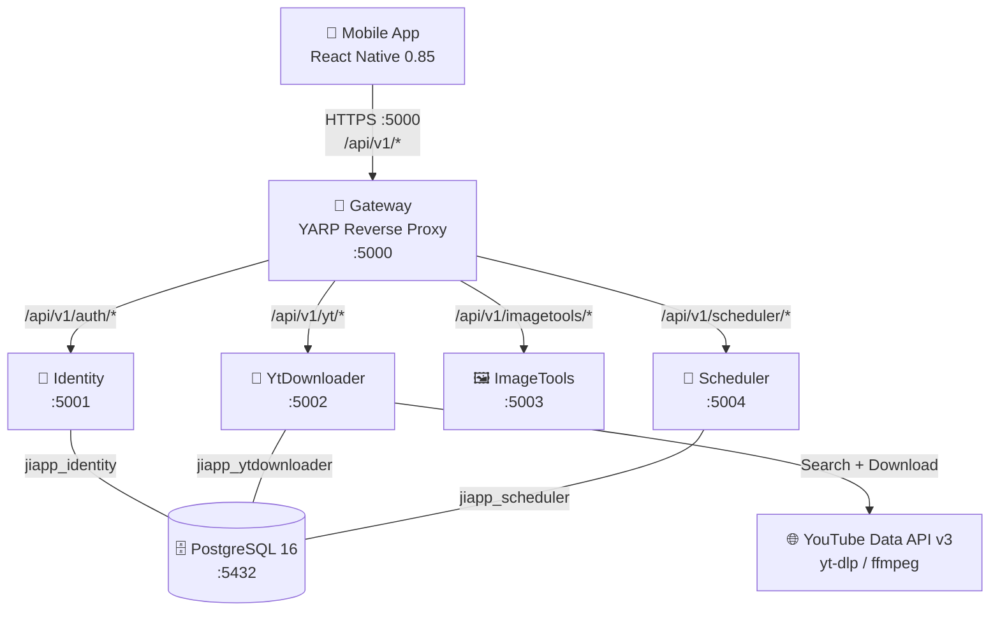

# JiApp — Salon Management Platform

A mobile-first salon management platform with a .NET 10 microservices backend and React Native Android app. Handles YouTube-powered background music, client and appointment scheduling, expense tracking, and revenue reporting.

## Architecture



All traffic enters through the Gateway on port 5000, which validates JWTs, applies rate limiting (14 policies), and proxies requests via YARP to downstream services. In development, services bind to `https://localhost:5001-5004`; in Docker, they use HTTP with Docker DNS service names.

## Tech Stack

### Backend

| Layer | Technology | Version |
|-------|-----------|---------|
| Runtime | .NET, ASP.NET Core Minimal APIs | 10.0 |
| API Gateway | YARP Reverse Proxy | 2.3 |
| Auth | ASP.NET Core Identity + JWT Bearer | 10.0 |
| Validation | FluentValidation | 12.1 |
| ORM | Entity Framework Core | 10.0 |
| Database (dev) | SQLite | 10.0 |
| Database (prod) | PostgreSQL 16 | — |
| Logging | Serilog | 10.0 |
| Media | yt-dlp + FFmpeg (subprocess) | — |
| Architecture | Vertical Slice Architecture | — |
| Testing | xUnit + Moq + FluentAssertions | — |

### Microservices

| Service | Port | Responsibility | Database |
|---------|------|---------------|----------|
| **Gateway** | 5000 | JWT auth, rate limiting, YARP reverse proxy, health dashboard | — |
| **Identity** | 5001 | Registration, login, JWT tokens, refresh token rotation | `jiapp_identity` |
| **YtDownloader** | 5002 | YouTube search, MP3 download, audio preview streaming | `jiapp_ytdownloader` |
| **ImageTools** | 5003 | Image processing (stub) | — |
| **Scheduler** | 5004 | Boards, clients, appointments, expenses, revenue reports | `jiapp_scheduler` |

### Mobile

| Layer | Technology | Version |
|-------|-----------|---------|
| Runtime | React Native (Hermes engine) | 0.85 |
| Language | TypeScript (strict mode) | 5.8 |
| UI | React | 19.2 |
| Navigation | React Navigation v7 (native stack + bottom tabs) | 7.x |
| HTTP | Axios | 1.16 |
| Storage | AsyncStorage + EncryptedStorage | 3.x / 4.x |
| i18n | i18next + react-i18next | 26.x |
| Media | React Native Track Player (audio) | 4.1 |
| Testing | Jest + React Native Testing Library + Playwright | 29.x / 13.x |
| Storybook | Storybook 10 (native + web) | 10.4 |

### Mobile Shell

Features are self-contained modules implementing the `JiModule` interface, registered at import time and rendered as bottom tabs:

- **yt-downloader** — YouTube MP3 downloader with search, preview, history, archive
- **image-tools** — Image processing (placeholder)
- **scheduler** — Weekend calendar: appointments, clients, services, expenses, revenue reports

## Core Concepts

### Vertical Slice Architecture

Every endpoint is a self-contained folder with endpoint, handler, validator, request, and response files. No cross-cutting layers — all logic for a feature lives in one place:

```
Features/Boards/CreateBoard/
├── CreateBoardEndpoint.cs   — HTTP route mapping
├── CreateBoardHandler.cs    — business logic
├── CreateBoardRequest.cs    — input DTO
└── CreateBoardValidator.cs  — FluentValidation rules
```

### JWT Authentication

1. Mobile sends credentials → `POST /api/v1/auth/login` (Gateway proxies to Identity)
2. Identity returns access token (15 min) + refresh token (7 days)
3. Mobile includes `Authorization: Bearer <token>` on all requests
4. Gateway validates JWT, proxies to downstream service
5. Each downstream service re-validates the JWT independently (shared signing key)
6. On 401, mobile auto-refreshes using stored credentials via Axios interceptor

### Security

- **Timing-attack resistant login**: password hash computed even for nonexistent users
- **Refresh token rotation**: old token revoked atomically (wrapped in DB transaction) with new token issuance
- **Reuse detection**: presenting an already-rotated token revokes ALL tokens for that user
- **Rate limiting**: Gateway (14 path-based policies) + Identity-level on auth endpoints
- **User enumeration prevention**: uniform error messages regardless of failure reason
- **JWT claims**: `jti` (unique token ID) and `iat` (issued-at timestamp) on every token
- **SQLite FK enforcement**: `Foreign Keys=True` on all dev databases

### Error Handling

All handlers return `Result<T>` with `ErrorCategory` (NotFound / AccessDenied / Validation / Conflict). Endpoints switch on category to return correct HTTP status codes — no fragile string matching:

```csharp
return result.ErrorCategory switch
{
    ResultCategories.NotFound => Results.NotFound(...),
    ResultCategories.AccessDenied => Results.Forbid(),
    ResultCategories.Conflict => Results.Conflict(...),
    _ => Results.BadRequest(...)
};
```

### Board Access Guard

A shared `BoardAccessGuard.VerifyBoardAccessAsync()` ensures consistent membership checks across all 31 scheduler endpoints. Every mutation verifies the current user is a board member.

### Database Provider Auto-Detection

Connection strings containing `Host=` → PostgreSQL (Npgsql). All others → SQLite. No configuration changes needed to switch environments.

## Project Structure

```
JiApp/
├── README.md
├── URLS.md                       # Complete endpoint registry + Mermaid graph
├── build-apk.sh                  # Android APK build (debug/release/install)
├── backend/
│   ├── JiApp.sln
│   ├── Directory.Build.props     # net10.0 + shared MSBuild settings
│   ├── deploy.sh                 # Docker Compose orchestration
│   ├── docker-compose.yml        # Base service definitions
│   ├── docker-compose.prod.yml   # Production overrides
│   ├── .env.example              # Required environment variables
│   ├── src/
│   │   ├── JiApp.Common/         # Result<T>, base entities, middleware, services
│   │   ├── JiApp.Gateway/        # YARP proxy, rate limiting, health dashboard
│   │   ├── JiApp.Identity/       # Auth: register, login, JWT, refresh tokens
│   │   ├── JiApp.YtDownloader/   # YouTube search, MP3 download, audio streaming
│   │   ├── JiApp.YtApi/          # YouTube Data API v3 client + yt-dlp wrapper
│   │   ├── JiApp.ImageTools/     # Image processing (stub)
│   │   └── JiApp.Scheduler/      # Boards, clients, appointments, expenses, reports
│   └── tests/
│       ├── JiApp.Gateway.Tests/        # 40 tests
│       ├── JiApp.Identity.Tests/       # 46 tests
│       ├── JiApp.YtDownloader.Tests/   # 31 tests
│       ├── JiApp.ImageTools.Tests/     # 8 tests
│       └── JiApp.Scheduler.Tests/      # 196 tests
└── mobile/
    ├── package.json
    ├── src/
    │   ├── modules/              # Feature modules (yt-downloader, image-tools, scheduler)
    │   │   └── scheduler/        #   screens, components, hooks, services, navigator
    │   ├── shell/                # Module registry + dynamic tab loader
    │   ├── context/              # AuthContext, BoardContext, ToastContext
    │   ├── services/             # apiClient, authService, storageService
    │   ├── screens/              # Login, Register, Search, Download, History, Settings
    │   ├── components/           # VideoCard, HistoryItem, FormInput, Toast, etc.
    │   ├── hooks/                # useSearch, useDownload, useHistory, useAuth
    │   └── navigation/           # AppNavigator, AuthNavigator, MainNavigator
    └── android/                  # Android native project
```

## Port Map

```
:5000  →  Gateway   (YARP reverse proxy — public)
:5001  →  Identity  (auth — internal)
:5002  →  YtDownloader (YouTube — internal)
:5003  →  ImageTools   (internal)
:5004  →  Scheduler    (internal)
:5432  →  PostgreSQL   (internal)
```

## Getting Started

### Backend

```bash
cd backend

# Copy and configure environment
cp .env.example .env

# Docker Compose (recommended)
./deploy.sh up -d

# Or run individually (dev mode, SQLite):
dotnet run --project src/JiApp.Identity
dotnet run --project src/JiApp.YtDownloader
dotnet run --project src/JiApp.Scheduler
dotnet run --project src/JiApp.Gateway

# Health check
curl http://localhost:5000/health
```

### Mobile

```bash
cd mobile
npm install

# Debug APK
cd .. && ./build-apk.sh --install

# Release APK
./build-apk.sh --release
```

### Tests

```bash
# Backend (281 tests)
dotnet test backend/JiApp.sln

# Mobile
cd mobile && npx jest
cd mobile && npx tsc --noEmit
```

## API Reference

See [URLS.md](./URLS.md) for the complete endpoint registry with Mermaid connection graph, live/dead endpoint status, and per-environment configuration details.

---

Private — JiApp is a personal project.
