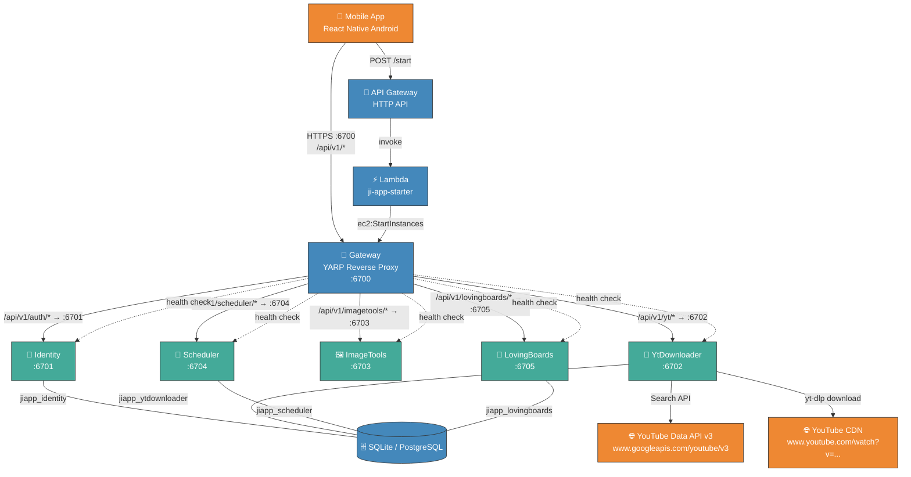

# JiApp — URL & Endpoint Registry

> Auto-generated from source analysis (2026-05-29). Covers all backend services, mobile app, Docker Compose, and external dependencies.

---

## Connection Graph



---

## 1. Infrastructure Layer

### Service Port Bindings

| Service | Dev URL | Prod URL | Port |
|---------|---------|----------|------|
| **Gateway** | `https://*:6700` | `https://*:6700` (Kestrel HTTPS, PFX cert) | 6700 |
| **Identity** | `https://*:6701` | `http://*:6701` (internal) | 6701 |
| **YtDownloader** | `https://*:6702` | `http://*:6702` (internal) | 6702 |
| **ImageTools** | `https://*:6703` | `http://*:6703` (internal) | 6703 |
| **Scheduler** | `https://*:6704` | `http://*:6704` (internal) | 6704 |
| **LovingBoards** | `https://*:6705` | `http://*:6705` (internal) | 6705 |

**Production notes:** Only the Gateway is publicly exposed (HTTPS on :6700 with baked CA cert). Internal services use HTTP. Production uses SQLite (no PostgreSQL).

### AWS Production Deployment

| Resource | Endpoint / Identifier | Purpose |
|----------|----------------------|---------|
| **Wake-up API** | `POST https://{api-id}.execute-api.eu-central-1.amazonaws.com/start` | Starts EC2 instance on-demand from mobile |
| **API Gateway** | `jiapp-wake` HTTP API | Routes `/start` → Lambda starter |
| **ECR Registry** | `{account}.dkr.ecr.eu-central-1.amazonaws.com/jiapp/{service}` | Docker image storage (5 repos) |
| **S3 Backups** | `s3://jiapp-backups-{account}/db-backups/` | SQLite database backups (30-day retention) |
| **S3 Deploy Config** | `s3://jiapp-deploy-config-{account}/current-tag.txt` | Current deploy image tag |
| **S3 Downloads** | `s3://jiapp-downloads-{account}/JiApp-latest.apk` | Public APK download (stable URL) |
| **S3 Downloads (versioned)** | `s3://jiapp-downloads-{account}/JiApp-{versionCode}.apk` | Archived versioned APK (immutable) |
| **S3 Downloads (metadata)** | `s3://jiapp-downloads-{account}/apk-metadata.json` | Public APK metadata (version, size, sha256) |

> **Portfolio site:** The APK and metadata are served to the public portfolio site at `https://jakubiwicki.github.io` (GitHub Pages, repo `JakubIwicki.github.io`). The site fetches `apk-metadata.json` client-side and links to `JiApp-latest.apk` for direct download. APKs are published via `./publish-apk.sh` (repo root). The APK binary is never committed to git.

See `deployment_plan/DEPLOYMENT_PLAN.md` for full architecture.

### Docker Compose Internal URLs

| Source | Target | Address |
|--------|--------|---------|
| Gateway → Identity | YARP destination | `http://identity:6701` |
| Gateway → YtDownloader | YARP destination | `http://ytdownloader:6702` |
| Gateway → ImageTools | YARP destination | `http://imagetools:6703` |
| Gateway → Scheduler | YARP destination | `http://scheduler:6704` |
| Gateway → LovingBoards | YARP destination | `http://lovingboards:6705` |
| All services → DB | PostgreSQL | `Host=postgres;Port=5432;Database=jiapp_{service}` |

---

## 2. Gateway (port 6700)

### YARP Reverse Proxy Routes

| Incoming Path | → Cluster | Dev Destination | Prod Destination |
|---------------|-----------|-----------------|------------------|
| `/api/v1/auth/{**catch-all}` | identity-cluster | `https://localhost:6701` | `http://identity:6701` |
| `/api/v1/yt/{**catch-all}` | yt-cluster | `https://localhost:6702` | `http://ytdownloader:6702` |
| `/api/v1/imagetools/{**catch-all}` | imagetools-cluster | `https://localhost:6703` | `http://imagetools:6703` |
| `/api/v1/scheduler/{**catch-all}` | scheduler-cluster | `https://localhost:6704` | `http://scheduler:6704` |
| `/api/v1/lovingboards/{**catch-all}` | lovingboards-cluster | `https://localhost:6705` | `http://lovingboards:6705` |

### Health Endpoints

| Method | Path | Description | Status |
|--------|------|-------------|--------|
| GET | `/health` | Basic health | 🟢 Live |
| GET | `/health/live` | Liveness probe | 🟢 Live |
| GET | `/health/ready` | Readiness probe | 🟢 Live |
| GET | `/health/dashboard` | HTML dashboard (dev only) | 🟢 Live |

### CORS

```
AllowAnyMethod() + AllowAnyHeader() + AllowCredentials() + SetIsOriginAllowed(_ => true)
```

All origins accepted. Same policy on all services.

---

## 3. Identity Service (port 6701) — prefix `/api/v1/auth`

| Method | Path | Handler | Status |
|--------|------|---------|--------|
| POST | `/api/v1/auth/register` | `RegisterEndpoint.cs` | 🟢 Live |
| POST | `/api/v1/auth/login` | `LoginEndpoint.cs` | 🟢 Live |
| POST | `/api/v1/auth/refresh` | `RefreshEndpoint.cs` | 🟢 Live |
| POST | `/api/v1/auth/logout` | `LogoutEndpoint.cs` | 🟢 Live |
| GET | `/api/v1/auth/me` | `MeEndpoint.cs` | 🟢 Live |
| PATCH | `/api/v1/auth/profile` | `UpdateProfileEndpoint.cs` | 🟢 Live |
| POST | `/api/v1/auth/change-password` | `ChangePasswordEndpoint.cs` | 🟢 Live |
| GET | `/api/v1/auth/health` | `Startup.cs` | 🟢 Live |
| GET | `/api/v1/auth/throw` | `Startup.cs` (dev only) | 🟢 Live |

**JWT Config:** Issuer=`JiApp-Identity`, Audience=`jiapp-gateway`

**RBAC (roles + permissions):** `login` and `me` responses include `roles` and `permissions` arrays. The access token carries one `ClaimTypes.Role` claim per role and one `"permission"` claim per effective permission. New users are assigned the `"Guest"` role on registration. Roles and permissions are managed via ASP.NET Core Identity (`AspNetRoles`, `AspNetRoleClaims`, `AspNetUserRoles` tables), seeded on startup by `RoleSeeder`. Unlike the old flat `UserModuleGrants` table (removed in migration `AddRbacRemoveModuleGrants`), permissions are role-based: `"Admin"` gets all permissions, `"User"` gets module access permissions, `"Guest"` gets none. Canonical permission strings are defined in `JiApp.Common.Permissions` (e.g. `scheduler.access`, `ytdownloader.access`, `lovingboards.access`).

---

## 4. YtDownloader Service (port 6702) — prefix `/api/v1/yt`

> Authorization: every `/api/v1/yt/**` endpoint (except `/health`) requires the `module` claim with value `YtDownloader`. A valid JWT lacking this claim is rejected with **403**.

### API Endpoints

| Method | Path | Handler | Status |
|--------|------|---------|--------|
| POST | `/api/v1/yt/search` | `SearchVideosEndpoint.cs` | 🟢 Live |
| GET | `/api/v1/yt/search/history` | `SearchHistoryEndpoint.cs` | 🟢 Live |
| PATCH | `/api/v1/yt/search/history/{id:long}/archive` | `ArchiveSearchEndpoint.cs` | 🟢 Live |
| POST | `/api/v1/yt/downloads/mp3` | `GetDownloadLinkEndpoint.cs` | 🟢 Live |
| GET | `/api/v1/yt/downloads/mp3/file/{id}` | `DownloadFileEndpoint.cs` | 🟢 Live |
| GET | `/api/v1/yt/downloads/history` | `DownloadHistoryEndpoint.cs` | 🟢 Live |
| PATCH | `/api/v1/yt/downloads/history/{id:long}/archive` | `ArchiveDownloadEndpoint.cs` | 🟢 Live |
| GET | `/api/v1/yt/history` | `GetHistoryEndpoint.cs` | 🟢 Live |
| GET | `/api/v1/yt/preview/{videoId}` | `StreamPreviewEndpoint.cs` | 🟢 Live |
| POST | `/api/v1/yt/assistant/chat` | `AssistantChatEndpoint.cs` | 🟢 Live |
| GET | `/api/v1/yt/health` | `Startup.cs` | 🟢 Live |

> **Assistant chat** is SSE (Server-Sent Events), JWT-gated (`module:YtDownloader`), routed through the Gateway at `/api/v1/yt/assistant/chat`. The endpoint accepts `POST` with `{ messages, language? }` and streams `text-delta`, `tool-step`, `search-results`, `download-offer`, and `done` events. Concurrent streams are capped at 1 (process-wide `SemaphoreSlim`); a second concurrent call receives **503** ("busy, try again").

### Internal Listener (not Gateway-routed)

| Method | Path | Handler | Status |
|--------|------|---------|--------|
| POST | `/mcp` | `Startup.cs` (MCP server) | 🟢 Live |

> The MCP SSE endpoint is **JWT-gated** (`module:YtDownloader`) but mapped **outside** `/api/v1/yt`, so YARP does NOT proxy it. It is reachable only inside the Docker network at `http://ytdownloader:6702/mcp`. Internal MCP hosts connect to it directly, not through the Gateway.

### External API Calls

| Target | URL Pattern | Library |
|--------|-------------|---------|
| YouTube Data API v3 | `https://www.googleapis.com/youtube/v3/search` | `Google.Apis.YouTube.v3` |
| YouTube video pages | `https://www.youtube.com/watch?v={videoId}` | yt-dlp |
| YouTube shortlinks | `https://youtu.be/{videoId}` | Validator regex |
| DeepSeek API | `https://api.deepseek.com/v1/chat/completions` | `Microsoft.Extensions.AI` |

**Valid YouTube URL domains:** `youtube.com`, `www.youtube.com`, `m.youtube.com`, `youtu.be`, `youtube-nocookie.com`, `www.youtube-nocookie.com`

---

## 5. ImageTools Service (port 6703) — prefix `/api/v1/imagetools`

| Method | Path | Handler | Status |
|--------|------|---------|--------|
| GET | `/api/v1/imagetools/health` | `Program.cs` | 🟢 Live |
| GET | `/api/v1/imagetools/ping` | `Program.cs` (auth required) | 🟢 Live |

---

## 6. Scheduler Service (port 6704) — prefix `/api/v1/scheduler`

> Authorization: every `/api/v1/scheduler/**` endpoint (except `/health`) requires the `module` claim with value `Scheduler`. A valid JWT lacking this claim is rejected with **403**.

#### Boards

| Method | Path | Handler | Status |
|--------|------|---------|--------|
| GET | `/api/v1/scheduler/boards` | `ListBoardsEndpoint.cs` | 🟢 Live |
| POST | `/api/v1/scheduler/boards` | `CreateBoardEndpoint.cs` | 🟢 Live |
| GET | `/api/v1/scheduler/boards/{id:long}` | `GetBoardEndpoint.cs` | 🟢 Live |
| PUT | `/api/v1/scheduler/boards/{id:long}` | `UpdateBoardEndpoint.cs` | 🟢 Live |
| DELETE | `/api/v1/scheduler/boards/{id:long}` | `DeleteBoardEndpoint.cs` | 🟢 Live |
| POST | `/api/v1/scheduler/boards/{id:long}/members` | `AddBoardMemberEndpoint.cs` | 🟢 Live |
| DELETE | `/api/v1/scheduler/boards/{id:long}/members/{userId:long}` | `RemoveBoardMemberEndpoint.cs` | 🟢 Live |

#### Clients

| Method | Path | Handler | Status |
|--------|------|---------|--------|
| GET | `/api/v1/scheduler/clients` | `ListClientsEndpoint.cs` | 🟢 Live |
| POST | `/api/v1/scheduler/clients` | `CreateClientEndpoint.cs` | 🟢 Live |
| GET | `/api/v1/scheduler/clients/{id:long}` | `GetClientEndpoint.cs` | 🟢 Live |
| PUT | `/api/v1/scheduler/clients/{id:long}` | `UpdateClientEndpoint.cs` | 🟢 Live |
| DELETE | `/api/v1/scheduler/clients/{id:long}` | `DeleteClientEndpoint.cs` | 🟢 Live |

#### Services

| Method | Path | Handler | Status |
|--------|------|---------|--------|
| GET | `/api/v1/scheduler/services` | `ListServicesEndpoint.cs` | 🟢 Live |
| POST | `/api/v1/scheduler/services` | `CreateServiceEndpoint.cs` | 🟢 Live |
| GET | `/api/v1/scheduler/services/{id:long}` | `GetServiceEndpoint.cs` | 🟢 Live |
| PUT | `/api/v1/scheduler/services/{id:long}` | `UpdateServiceEndpoint.cs` | 🟢 Live |
| DELETE | `/api/v1/scheduler/services/{id:long}` | `DeleteServiceEndpoint.cs` | 🟢 Live |

#### Appointments

| Method | Path | Handler | Status |
|--------|------|---------|--------|
| GET | `/api/v1/scheduler/appointments` | `ListAppointmentsEndpoint.cs` | 🟢 Live |
| POST | `/api/v1/scheduler/appointments` | `CreateAppointmentEndpoint.cs` | 🟢 Live |
| GET | `/api/v1/scheduler/appointments/{id:long}` | `GetAppointmentEndpoint.cs` | 🟢 Live |
| PUT | `/api/v1/scheduler/appointments/{id:long}` | `UpdateAppointmentEndpoint.cs` | 🟢 Live |
| PATCH | `/api/v1/scheduler/appointments/{id:long}/status` | `UpdateAppointmentStatusEndpoint.cs` | 🟢 Live |
| DELETE | `/api/v1/scheduler/appointments/{id:long}` | `DeleteAppointmentEndpoint.cs` | 🟢 Live |

#### Expenses

| Method | Path | Handler | Status |
|--------|------|---------|--------|
| GET | `/api/v1/scheduler/expenses` | `ListExpensesEndpoint.cs` | 🟢 Live |
| POST | `/api/v1/scheduler/expenses` | `CreateExpenseEndpoint.cs` | 🟢 Live |
| GET | `/api/v1/scheduler/expenses/{id:long}` | `GetExpenseEndpoint.cs` | 🟢 Live |
| PUT | `/api/v1/scheduler/expenses/{id:long}` | `UpdateExpenseEndpoint.cs` | 🟢 Live |
| DELETE | `/api/v1/scheduler/expenses/{id:long}` | `DeleteExpenseEndpoint.cs` | 🟢 Live |

#### Reports & Day Totals

| Method | Path | Handler | Status |
|--------|------|---------|--------|
| GET | `/api/v1/scheduler/day-totals` | `DayTotalsEndpoint.cs` | 🟢 Live |
| GET | `/api/v1/scheduler/reports/revenue` | `RevenueReportEndpoint.cs` | 🟢 Live |
| GET | `/api/v1/scheduler/reports/clients` | `ClientReportEndpoint.cs` | 🟢 Live |

#### Health

| Method | Path | Handler | Status |
|--------|------|---------|--------|
| GET | `/api/v1/scheduler/health` | `Startup.cs` | 🟢 Live |

---

## 7. LovingBoards Service (port 6705) — prefix `/api/v1/lovingboards`

> Authorization: every `/api/v1/lovingboards/**` endpoint (except `/health`) requires the `module` claim with value `LovingBoards`. A valid JWT lacking this claim is rejected with **403**.

#### Boards

| Method | Path | Handler | Status |
|--------|------|---------|--------|
| GET | `/api/v1/lovingboards/boards` | `ListBoardsEndpoint.cs` | 🟢 Live |
| POST | `/api/v1/lovingboards/boards` | `CreateBoardEndpoint.cs` | 🟢 Live |
| GET | `/api/v1/lovingboards/boards/{id:long}` | `GetBoardEndpoint.cs` | 🟢 Live |
| PUT | `/api/v1/lovingboards/boards/{id:long}` | `UpdateBoardEndpoint.cs` | 🟢 Live |
| DELETE | `/api/v1/lovingboards/boards/{id:long}` | `DeleteBoardEndpoint.cs` | 🟢 Live |
| POST | `/api/v1/lovingboards/boards/{id:long}/members` | `AddBoardMemberEndpoint.cs` | 🟢 Live |
| DELETE | `/api/v1/lovingboards/boards/{id:long}/members/{userId:long}` | `RemoveBoardMemberEndpoint.cs` | 🟢 Live |
| GET | `/api/v1/lovingboards/boards/{id:long}/stream` | `StreamBoardEndpoint.cs` | 🟢 Live |

#### Items

| Method | Path | Handler | Status |
|--------|------|---------|--------|
| POST | `/api/v1/lovingboards/boards/{boardId:long}/items` | `CreateItemEndpoint.cs` | 🟢 Live |
| PUT | `/api/v1/lovingboards/boards/{boardId:long}/items/{itemId:long}` | `UpdateItemEndpoint.cs` | 🟢 Live |
| PUT | `/api/v1/lovingboards/boards/{boardId:long}/items/{itemId:long}/status` | `SetItemStatusEndpoint.cs` | 🟢 Live |
| DELETE | `/api/v1/lovingboards/boards/{boardId:long}/items/{itemId:long}` | `DeleteItemEndpoint.cs` | 🟢 Live |
| POST | `/api/v1/lovingboards/boards/{boardId:long}/items/clear-completed` | `ClearCompletedEndpoint.cs` | 🟢 Live |
| POST | `/api/v1/lovingboards/boards/{boardId:long}/items/reset-weekly` | `ResetWeeklyItemsEndpoint.cs` | 🟢 Live |

#### Health

| Method | Path | Handler | Status |
|--------|------|---------|--------|
| GET | `/api/v1/lovingboards/health` | `Startup.cs` | 🟢 Live |

---

## 8. Mobile App (React Native)

### API Base URL

```
https://{DEV_IP}:6700/api/v1
```

Override via build-time env: `JIAPP_API_URL`. Defaults to `localhost`; set `JIAPP_API_URL` at build time for physical devices.

### API Calls by Module

All calls go through the Gateway at `:6700` and are proxied via YARP.

#### Authentication

| Method | Path | Service File | Screen/Context |
|--------|------|-------------|----------------|
| POST | `/api/v1/auth/login` | `authService.ts:9` | LoginScreen |
| POST | `/api/v1/auth/register` | `authService.ts:25` | RegisterScreen |
| GET | `/api/v1/auth/me` | `authService.ts:31` | AuthContext |
| PATCH | `/api/v1/auth/profile` | `authService.ts` | EditProfileScreen |
| POST | `/api/v1/auth/change-password` | `authService.ts` | EditProfileScreen |

#### YouTube Search & History

| Method | Path | Service File |
|--------|------|-------------|
| POST | `/api/v1/yt/search` | `searchService.ts:14` |
| GET | `/api/v1/yt/search/history` | `searchService.ts:29` |
| PATCH | `/api/v1/yt/search/history/{id}/archive` | `searchService.ts:5` |
| GET | `/api/v1/yt/history` | `historyService.ts:8` |

#### YouTube Downloads

| Method | Path | Service File |
|--------|------|-------------|
| POST | `/api/v1/yt/downloads/mp3` | `downloadService.ts:13` |
| GET | `/api/v1/yt/downloads/history` | `downloadService.ts:28` |
| PATCH | `/api/v1/yt/downloads/history/{id}/archive` | `downloadService.ts:36` |

#### YouTube Preview (Audio Streaming)

| Method | Path | Service File |
|--------|------|-------------|
| GET | `/api/v1/yt/preview/{videoId}` | `previewService.ts:5` |

Passed directly to `TrackPlayer.add()` as audio source URL.

#### File Downloads

Uses `ReactNativeBlobUtil` with a dynamic `downloadUrl` obtained from `POST /api/v1/yt/downloads/mp3`. Files are saved to Android `MediaStore` via `ReactNativeBlobUtil.MediaCollection.copyToMediaStore()`.

#### Scheduler — Boards

| Method | Path | Service File |
|--------|------|-------------|
| GET | `/api/v1/scheduler/boards` | `boardService.ts:13` |
| POST | `/api/v1/scheduler/boards` | `boardService.ts:18` |
| GET | `/api/v1/scheduler/boards/{id}` | `boardService.ts:23` |
| PUT | `/api/v1/scheduler/boards/{id}` | `boardService.ts:28` |
| DELETE | `/api/v1/scheduler/boards/{id}` | `boardService.ts:32` |
| POST | `/api/v1/scheduler/boards/{id}/members` | `boardService.ts:36` |
| DELETE | `/api/v1/scheduler/boards/{id}/members/{userId}` | `boardService.ts:40` |

#### Scheduler — Appointments

| Method | Path | Service File |
|--------|------|-------------|
| POST | `/api/v1/scheduler/appointments` | `appointmentService.ts:34` |
| GET | `/api/v1/scheduler/appointments` | `appointmentService.ts:42` |
| GET | `/api/v1/scheduler/appointments/{id}` | `appointmentService.ts:49` |
| PUT | `/api/v1/scheduler/appointments/{id}` | `appointmentService.ts:57` |
| PATCH | `/api/v1/scheduler/appointments/{id}/status` | `appointmentService.ts:64` |
| DELETE | `/api/v1/scheduler/appointments/{id}` | `appointmentService.ts:68` |

#### Scheduler — Services

| Method | Path | Service File |
|--------|------|-------------|
| POST | `/api/v1/scheduler/services` | `serviceCatalogService.ts:26` |
| GET | `/api/v1/scheduler/services` | `serviceCatalogService.ts:38` |
| GET | `/api/v1/scheduler/services/{id}` | `serviceCatalogService.ts:44` |
| PUT | `/api/v1/scheduler/services/{id}` | `serviceCatalogService.ts:53` |
| DELETE | `/api/v1/scheduler/services/{id}` | `serviceCatalogService.ts:57` |

#### Scheduler — Clients

| Method | Path | Service File |
|--------|------|-------------|
| POST | `/api/v1/scheduler/clients` | `clientService.ts:36` |
| GET | `/api/v1/scheduler/clients` | `clientService.ts:41` |
| GET | `/api/v1/scheduler/clients/{id}` | `clientService.ts:48` |
| PUT | `/api/v1/scheduler/clients/{id}` | `clientService.ts:58` |
| DELETE | `/api/v1/scheduler/clients/{id}` | `clientService.ts:62` |

#### Scheduler — Expenses

| Method | Path | Service File |
|--------|------|-------------|
| POST | `/api/v1/scheduler/expenses` | `expenseService.ts:48` |
| GET | `/api/v1/scheduler/expenses` | `expenseService.ts:57` |
| GET | `/api/v1/scheduler/expenses/{id}` | `expenseService.ts:65` |
| PUT | `/api/v1/scheduler/expenses/{id}` | `expenseService.ts:74` |
| DELETE | `/api/v1/scheduler/expenses/{id}` | `expenseService.ts:78` |

#### Scheduler — Reports

| Method | Path | Service File |
|--------|------|-------------|
| GET | `/api/v1/scheduler/reports/revenue` | `reportService.ts:10` |
| GET | `/api/v1/scheduler/reports/clients` | `reportService.ts:20` |

### Android Network Security Config

```xml
<!-- Allows cleartext only to dev machine -->
<domain-config cleartextTrafficPermitted="true">
    <domain includeSubdomains="false">{DEV_IP}</domain>
    <trust-anchors>
        <certificates src="@raw/jiapp_dev_ca" />
    </trust-anchors>
</domain-config>
```

Custom CA cert `jiapp_dev_ca` trusted for HTTPS with self-signed dev certificate.

---

## 8. Mock & Test URLs

### YouTube CDN (mock data & stories)

| URL | Used In |
|-----|---------|
| `https://www.youtube.com/watch?v=dQw4w9WgXcQ` | Mocks, stories, tests |
| `https://www.youtube.com/watch?v=9bZkp7q19f0` | Mocks, stories |
| `https://i.ytimg.com/vi/dQw4w9WgXcQ/hqdefault.jpg` | Mocks, stories |
| `https://i.ytimg.com/vi/dQw4w9WgXcQ/maxresdefault.jpg` | Stories |
| `https://i.ytimg.com/vi/jfKfPfyJRdk/hqdefault.jpg` | FullApp.stories |
| `https://i.ytimg.com/vi/9bZkp7q19f0/hqdefault.jpg` | FullApp.stories, mocks |
| `https://i.ytimg.com/vi/abc123/default.jpg` | Tests |
| `https://youtube.com/watch?v=abc123` | Tests |

### example.com (test placeholders)

| URL | Used In |
|-----|---------|
| `https://example.com/downloads/mock-file.mp3` | Download mocks |
| `https://example.com/download/abc123` | Download tests |
| `https://example.com/dl` | Download tests |
| `https://example.com/preview/{videoId}` | Preview tests |
| `https://example.com/thumb.jpg` | Screen tests |
| `https://example.com/video.mp4` | Screen tests |
| `https://example.com/{id}.jpg` | Hook tests |
| `https://example.com/{id}.mp4` | Hook tests |
| `https://example.com/thumbnail.jpg` | Component tests |

### Android File System (mock)

| Path | Used In |
|------|---------|
| `/storage/emulated/0/Download/{fileName}.mp3` | Download mocks |

---

## 9. Environment Variables (URL-related)

| Variable | Purpose | Default |
|----------|---------|---------|
| `POSTGRES_PASSWORD` | Database password | *(required)* |
| `JWT_KEY` | JWT signing key (min 32 chars) | `{JWT_KEY}` |
| `JWT_ISSUER` | JWT issuer claim | `JiApp-Identity` |
| `JWT_AUDIENCE` | JWT audience claim | `jiapp-gateway` |
| `JWT_ACCESS_EXPIRE` | Access token lifetime | 15 minutes |
| `JWT_REFRESH_EXPIRE` | Refresh token lifetime | 7 days |
| `YOUTUBE_API_KEY` | YouTube Data API v3 key | *(required)* |
| `DEEPSEEK_API_KEY` | DeepSeek API key for assistant chat | *(empty = 503)* |
| `DEEPSEEK_MODEL` | DeepSeek model override | `deepseek-chat` |
| `YT_GC_HEAP_LIMIT` | YtDownloader GC heap hard limit (hex) | *(empty = no cap)* |
| `JIAPP_API_URL` | Mobile API base URL (build-time) | `https://localhost:6700/api/v1` |
| `CORS_ALLOWED_ORIGIN` | CORS origin override | *(none)* |

---

## Quick Reference

### Port Map

```
:6700  →  Gateway (YARP reverse proxy)
:6701  →  Identity (auth)
:6702  →  YtDownloader (YouTube search/download/preview)
:6703  →  ImageTools
:6704  →  Scheduler (boards, clients, expenses, reports)
:6705  →  LovingBoards (shared collaborative boards)
:5432  →  PostgreSQL
```

### Health Checks

```
Gateway:     GET /health
Identity:    GET /api/v1/auth/health
YtDownloader: GET /api/v1/yt/health
ImageTools:  GET /api/v1/imagetools/health
Scheduler:   GET /api/v1/scheduler/health
LovingBoards: GET /api/v1/lovingboards/health
```

### Base URLs

| Environment | URL |
|-------------|-----|
| Dev (local) | `https://localhost:6700` |
| Dev (mobile) | `https://{DEV_IP}:6700` |
| Prod (Docker) | `http://gateway:6700` |

### API Prefixes

```
/api/v1/auth/*       →  Identity Service
/api/v1/yt/*         →  YtDownloader Service
/api/v1/imagetools/* →  ImageTools Service
/api/v1/scheduler/*  →  Scheduler Service
/api/v1/lovingboards/* → LovingBoards Service
```

### Legend

| Icon | Meaning |
|------|---------|
| 🟢 Live | Endpoint registered and reachable |
| 🔴 Mock | Test/mock data only, not a real endpoint |
```

---

*Generated by analyzing ~60 source files across backend (`backend/src/`), mobile (`mobile/src/`), infrastructure (`backend/docker-compose*.yml`), and configuration.*
